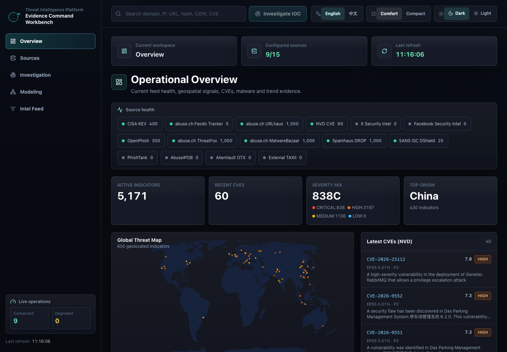
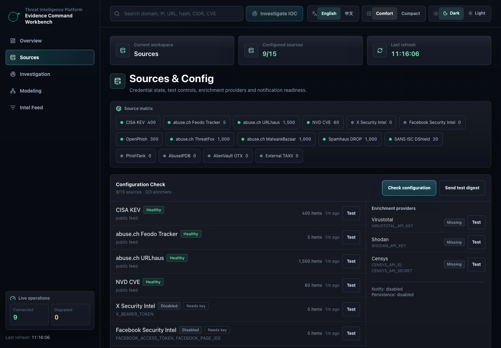
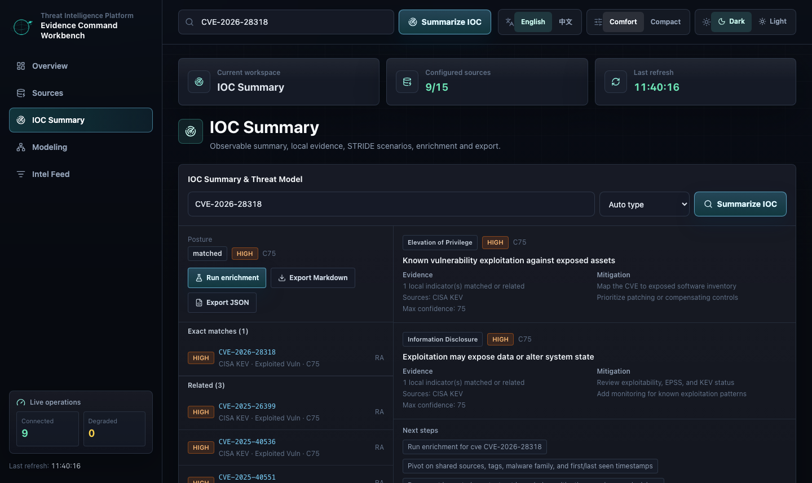
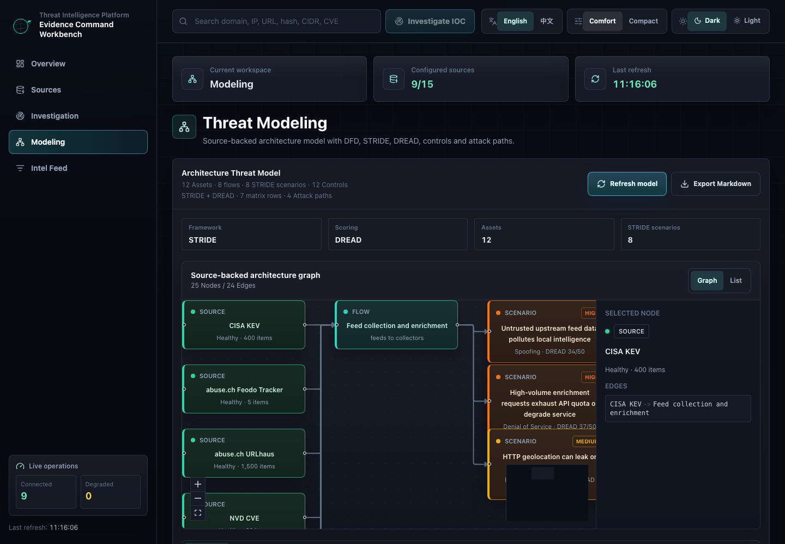
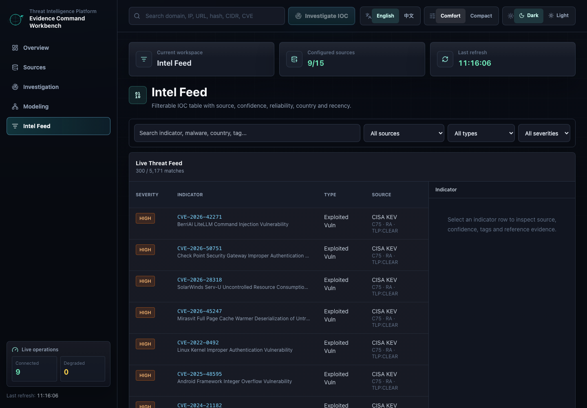
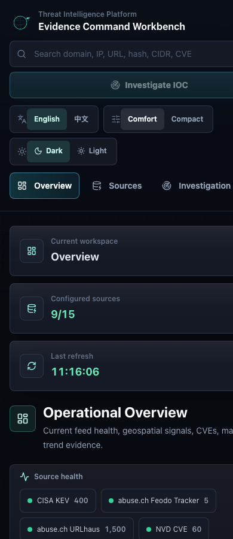

<p align="center">
  
</p>

<h1 align="center">Threat Intelligence Platform</h1>

<p align="center">
  <strong>面向来源证据、IOC 汇总和 STRIDE/DREAD 威胁建模的证据指挥工作台。</strong>
</p>

<p align="center">
  <strong>中文</strong> | <a href="README_EN.md">EN</a>
</p>

<p align="center">
  
</p>

代码事实、已落地控制和需独立架构决策的能力边界见 [`docs/REMEDIATION_STATUS.md`](docs/REMEDIATION_STATUS.md)。

## 功能截图

<table>
  <tr>
    <td width="50%">
      
      <br />
      <sub><strong>总览</strong></sub>
    </td>
    <td width="50%">
      
      <br />
      <sub><strong>来源与配置</strong></sub>
    </td>
  </tr>
  <tr>
    <td width="50%">
      
      <br />
      <sub><strong>IOC 汇总</strong></sub>
    </td>
    <td width="50%">
      
      <br />
      <sub><strong>威胁建模</strong></sub>
    </td>
  </tr>
  <tr>
    <td width="50%">
      
      <br />
      <sub><strong>情报列表</strong></sub>
    </td>
    <td width="50%">
      
      <br />
      <sub><strong>移动端工作台</strong></sub>
    </td>
  </tr>
</table>

Threat Intelligence Platform 是一个面向安全运营、威胁情报分析、应急响应和红蓝队研究的威胁情报工作台。项目使用 React + Vite + Tailwind 构建前端，使用 Node.js + Express + TypeScript 构建后端，聚合公开和可选配置的威胁情报源，并把数据统一成可调查、可建模、可导出的证据模型。

当前 UI 定位为 **证据指挥工作台**：不是装饰性大屏，也不是营销页，而是面向分析人员的密集型操作界面。它强调来源、证据、置信度、可靠性、时间戳、配置状态和可复核的威胁模型。

### 可以展示什么数据

- 情报源健康状态、刷新时间、配置状态和单源测试结果。
- 全球地理化 IOC、严重性分布、主要来源国家或地区、趋势、CVE、Hash 和恶意软件家族情报。
- 可过滤威胁情报列表，包含来源、类型、严重性、国家或地区、时间、置信度、可靠性、TLP、标签和参考链接。
- 针对域名、IP、URL、Hash、CIDR、CVE 的 IOC 汇总结果。
- 基于本地情报证据的 STRIDE 场景、DREAD 评分、缓解建议、下一步行动、Markdown/JSON 报告和历史记录。
- 架构级威胁建模，包含资产、信任边界、数据流、攻击路径、控制措施和 Graph/List 双视图。
- STIX 2.1 导出和只读 TAXII 2.1 API；外部 TAXII 导入会保留关系、实体、标记和对象版本，同时抽取 IOC/CVE 供检索。

系统不会凭空虚构情报来源。Graph、威胁建模和建议都基于当前项目已有的数据源、本地证据、配置状态和后端接口生成。

### UI 工作区

| 工作区 | 作用 |
| --- | --- |
| **总览 Overview** | 情报源健康、核心指标、地图、CVE、趋势、Hash/Malware 总览。 |
| **威胁狩猎 Hunt** | 单个或批量 IOC 查询、CSV 导出、查询耗时和持久化狩猎历史。 |
| **案例 Cases** | 创建调查案例，维护严重性、状态、IOC 和分析评论。 |
| **规则与自动化 Rules** | 配置 IOC 匹配或阈值规则、Webhook/自动富化动作，并查看执行历史。 |
| **情报质量 Quality** | 质量分布、30 日趋势、时间衰减和误报标记。 |
| **来源网络 Network** | 以关系图查看来源、指标和证据之间的关联。 |
| **IOC 时间线 Timeline** | 按时间回放情报事件，支持速度、上一个/下一个事件控制。 |
| **地理热力图 Heatmap** | 展示国家或地区分布、平均严重性和高风险位置。 |
| **来源与配置 Sources & Config** | 来源矩阵、配置检查、单源测试、富化服务商测试、通知测试。 |
| **IOC 汇总** | IOC 命令、精确匹配、关联指标、富化、STRIDE 场景、缓解建议、报告导出和来源 Graph。 |
| **威胁建模 Threat Modeling** | 架构模型、DFD 风格 Graph、STRIDE/DREAD 场景、资产、数据流、控制项和攻击路径。 |
| **情报列表 Intel Feed** | Sticky 筛选器、威胁表格、行选中、详情侧栏和外部参考链接。 |
| **运维与交换 Operations** | 文本 IOC 提取、STIX 对象与关系图、检测制品、后台任务、审计和指标。 |

### 主题、Logo 与品牌资产

平台支持用户显式切换深色和浅色模式，选择会保存到 `localStorage.theme`，favicon 也会跟随当前主题切换。

| 资产 | 用途 |
| --- | --- |
| `frontend/public/brand-logo-dark.png` | 深色模式 UI logo 和 favicon。 |
| `frontend/public/brand-logo-light.png` | 浅色模式 UI logo 和 favicon。 |
| `frontend/public/brand-logo.png` | 默认兼容 logo。 |

旧图标已移除。

### 情报来源

#### 公开来源，无需 API key

| 来源 | 内容 | 指标类型 |
| --- | --- | --- |
| CISA KEV | 已知被利用漏洞目录 | CVE、已利用漏洞 |
| abuse.ch Feodo Tracker | Botnet C2 服务器 IP | IP、C2 |
| abuse.ch URLhaus | 恶意软件分发 URL | URL、恶意软件主机 |
| abuse.ch ThreatFox | 最新 IOC | IP、域名、URL、Hash |
| abuse.ch MalwareBazaar | 恶意样本 Hash 与家族 | SHA256、恶意软件家族 |
| OpenPhish | 社区钓鱼 URL | URL、钓鱼 |
| Spamhaus DROP | 恶意 IPv4 网段 | CIDR、恶意网络 |
| SANS ISC DShield | 高攻击 IPv4 子网 | CIDR、扫描网络 |
| NVD + FIRST EPSS | CVE、CVSS 和利用概率 | CVE、漏洞 |

#### 可选凭据来源和富化服务

| 集成 | 作用 | 必需配置 |
| --- | --- | --- |
| X Recent Search | 按查询采集安全相关帖子 | `X_BEARER_TOKEN` |
| Facebook Graph API | 采集指定安全页面帖子 | `FACEBOOK_ACCESS_TOKEN`, `FACEBOOK_PAGE_IDS` |
| PhishTank | 已验证在线钓鱼 URL | `PHISHTANK_APP_KEY` |
| AbuseIPDB | 高置信度恶意 IPv4 黑名单 | `ABUSEIPDB_API_KEY` |
| AlienVault OTX | 订阅 Pulse 中的指标 | `OTX_API_KEY` |
| External TAXII | 外部 TAXII collection 中的 STIX 2.1 对象 | `TAXII_IMPORT_OBJECTS_URL` |
| MISP | MISP 已发布、可用于 IDS 的 Attribute（只读、分页、增量） | `MISP_BASE_URL` + `MISP_API_KEY` |
| VirusTotal | 按需富化可观测对象 | `VIRUSTOTAL_API_KEY` |
| Shodan | 按需 IP 富化 | `SHODAN_API_KEY` |
| Censys | 按需主机富化 | `CENSYS_API_ID`, `CENSYS_API_SECRET` |

凭据缺失不会影响公开源刷新。未配置的凭据源会显示为 disabled，并可在配置面板中查看缺失项。

### 架构

```text
threat-intel-platform/
├── backend/
│   └── src/
│       ├── sources/                  情报源适配器
│       ├── store.ts                  刷新、归一化、缓存、关联
│       ├── architectureThreatModel.ts 架构威胁建模
│       ├── reports.ts                Markdown 报告
│       ├── security.ts               API token、角色、限速、审计
│       ├── stix.ts / taxii.ts        STIX 和 TAXII
│       └── index.ts                  Express REST/SSE/TAXII 服务
└── frontend/
    └── src/
        ├── App.tsx                   应用壳、工作区、主题切换
        ├── components/               面板、表格、地图、Graph
        ├── i18n.ts                   中英文文案
        └── index.css                 设计 token、深浅色主题
```

后端能力：

- Express + TypeScript API。
- 启动刷新和持久化后台任务刷新，默认 `REFRESH_INTERVAL_MS=900000`。
- 每个来源有独立最小刷新间隔，避免过度请求上游。
- 设置 `DATA_DIR` 后持久化 IOC、CVE、来源观测、历史对象、原始 STIX 图及版本、MISP 检测制品、案件、规则、审计和后台任务。
- 后台任务具备租约、去重、重试、指数退避和死信状态。
- `/api/stream` 提供刷新事件的 SSE 流。

前端能力：

- React 18 + Vite 8 + TypeScript + Tailwind CSS。
- 使用 `@xyflow/react` 构建 Graph Explorer。
- 地图数据来自本地 `world-atlas`，运行时不依赖 CDN 加载底图。
- 使用 URL hash 管理工作区，不引入 React Router。

### 环境要求

- Node.js `>=20.19`。
- 推荐 npm `>=11`。
- `DATA_DIR` 持久化使用 Node SQLite 能力，启用持久化时推荐 Node 22+。

### 快速启动

```bash
npm install
npm run dev
```

打开：

```text
http://localhost:5173
```

开发端口：

- 后端 API：`http://localhost:4000`
- 前端 dev server：`http://localhost:5173`
- Vite dev proxy：`/api` 转发到 `VITE_API_PROXY` 或 `http://localhost:4000`

### 生产构建

```bash
npm run build
npm start
```

当 `frontend/dist` 存在时，后端会直接托管前端构建产物和 API，默认端口为 `4000`。

### 脚本

| 命令 | 说明 |
| --- | --- |
| `npm run dev` | 同时启动后端和前端 watch 模式。 |
| `npm run build` | 构建后端和前端。 |
| `npm run typecheck` | 检查两个 workspace 的 TypeScript 类型。 |
| `npm run lint` | 检查两个 workspace 的 ESLint。 |
| `npm run test` | 运行后端、前端和 Python 测试。 |
| `npm start` | 启动已编译后端，并在有前端构建产物时托管前端。 |

### REST API

| 接口 | 说明 |
| --- | --- |
| `GET /api/health` | 服务状态和情报源健康状态。探活接口保持开放。 |
| `GET /api/stream` | Server-Sent Events 刷新流。 |
| `GET /api/threats` | 威胁指标，可按 `source`、`type`、`severity`、`q`、`limit` 过滤。 |
| `GET /api/map` | 用于地图的地理化指标。 |
| `GET /api/cve` | NVD 最新 CVE。 |
| `GET /api/hashes` | Hash IOC 和恶意软件家族聚合。 |
| `GET /api/stats` | 按来源、类型、严重性、国家或地区聚合的统计。 |
| `GET /api/sources/health` | 每个来源的刷新、错误和健康状态。 |
| `GET /api/sources/history` | 启用持久化后的来源健康历史。 |
| `GET /api/trend` | 启用持久化后的指标数量趋势。 |
| `GET /api/config/status` | 非敏感配置状态，包括来源、富化服务、通知和持久化。 |
| `POST /api/config/test` | 测试单个来源或富化服务。启用认证后需要 admin 角色。 |
| `GET /api/enrich` | 对单个可观测对象进行按需富化。启用认证后需要 analyst 角色。 |
| `GET /api/investigate` | IOC 汇总和 STRIDE 模型。启用认证后需要 analyst 角色。 |
| `GET /api/investigations/history` | IOC 汇总历史。 |
| `GET /api/investigate/report` | 生成 IOC 汇总 Markdown 或 JSON 报告。 |
| `GET /api/threat-model` | 架构级威胁模型，支持 JSON 或 Markdown。 |
| `GET /api/export/stix` | 导出 STIX 2.1 bundle。 |
| `GET /api/notify/status` | 通知配置和最近运行状态。 |
| `POST /api/notify/test` | 向已配置渠道发送测试摘要。启用认证后需要 admin 角色，生产环境可能还需要 `NOTIFY_TEST_TOKEN`。 |
| `GET /api/audit` | 启用持久化后的审计事件。启用认证后需要 admin 角色。 |
| `GET /api/metrics` | Prometheus 文本指标：情报量、来源健康、刷新时间、持久化和任务状态。需要 viewer 角色。 |
| `GET /api/detection-artifacts` | 查询 MISP 导入的 Sigma/YARA/Snort 检测制品；仅存储展示，不自动执行。需要 analyst 角色和持久化。 |
| `GET /api/stix/objects` | 按 `type`/`id` 查询经 TLP 授权过滤的 STIX 实体和版本。需要 analyst 角色。 |
| `GET /api/stix/graph/:id` | 查询 STIX 对象的关系邻域，`depth` 限制为 0-3。需要 analyst 角色。 |
| `POST /api/extract-iocs` | 从邮件/工单/新闻正文确定性提取并 refang URL、域名、IP、Hash、CVE，同时标注本地命中。需要 analyst 角色。 |

TAXII 接口：

- `GET /taxii2/`
- `GET /taxii2/root/`
- `GET /taxii2/root/collections/`
- `GET /taxii2/root/collections/:id/objects/`
- `GET /taxii2/root/collections/:id/manifest/`

### IOC 汇总示例

```bash
curl 'http://localhost:4000/api/investigate?indicator=CVE-2026-28318&type=cve&lang=en'
curl 'http://localhost:4000/api/investigate?indicator=example.com&type=domain&lang=zh'
curl 'http://localhost:4000/api/investigate/report?indicator=example.com&type=domain&format=markdown&lang=en'
curl 'http://localhost:4000/api/investigate/report?indicator=example.com&type=domain&format=json&lang=zh'
```

### 架构威胁建模示例

```bash
curl 'http://localhost:4000/api/threat-model?lang=en'
curl 'http://localhost:4000/api/threat-model?lang=zh'
curl 'http://localhost:4000/api/threat-model?format=markdown&lang=en'
```

架构模型包含：

- 范围和方法论。
- 资产、信任边界和数据流。
- STRIDE 场景和 DREAD 评分。
- 攻击路径和控制措施。
- 假设和证据说明。

### 配置检查

```bash
curl http://localhost:4000/api/config/status
curl -X POST http://localhost:4000/api/config/test \
  -H 'Content-Type: application/json' \
  -d '{"kind":"source","id":"cisa_kev"}'
curl -X POST http://localhost:4000/api/config/test \
  -H 'Content-Type: application/json' \
  -d '{"kind":"provider","id":"virustotal"}'
curl -X POST http://localhost:4000/api/notify/test
```

`/api/config/status` 不返回任何 secret，只返回是否配置、缺失环境变量名等安全状态信息。

### 安全与访问控制

开发环境可以不启用认证。生产环境默认 fail-closed：必须配置角色 Token 或可信认证代理；只有显式设置 `ALLOW_INSECURE_NO_AUTH=true` 才允许无认证运行。

配置 token 后：

- `API_TOKEN` 视为 admin token。
- `API_VIEWER_TOKENS`、`API_ANALYST_TOKENS`、`API_ADMIN_TOKENS` 提供角色级访问。
- viewer 用于只读数据。
- analyst 用于调查、富化、报告和威胁建模。
- admin 用于集成测试、通知测试和审计访问。

STIX/TAXII 导出同时执行 TLP 分发策略：viewer 最高 GREEN，analyst 最高 AMBER，admin 可访问 RED 和未知自定义标记；被过滤对象关联的悬空 relationship 也会移除。

Token 传递方式：

- `Authorization: Bearer <token>`
- `x-api-token: <token>`

浏览器生产部署推荐由同源反向代理完成 OIDC/SAML/SSO 认证，并通过 `AUTH_PROXY_ENABLED`、`AUTH_PROXY_SHARED_SECRET` 注入用户和角色。不要把共享密钥或生产 API Token 放进浏览器构建产物。

浏览器部署建议配置 `CORS_ORIGINS`、`API_RATE_LIMIT_WINDOW_MS`、`API_RATE_LIMIT_MAX` 和 `JSON_BODY_LIMIT`。

STIX、TAXII 和 Markdown 导出均返回 `Content-Digest` 与 `X-Content-SHA256`。配置 `EXPORT_SIGNING_KEY` 后还会返回 `X-Content-HMAC-SHA256`；`EXPORT_SIGNING_KEY_ID` 用于标识轮换中的密钥，密钥本身不会进入响应。

### 告警推送

定时告警摘要默认关闭。设置 `NOTIFY_ENABLED=true` 并配置至少一个渠道后启用：

- DingTalk 自定义机器人。
- Telegram Bot。
- Slack Incoming Webhook。
- 通用 Webhook。

服务启动时会以当前数据作为 baseline，所以第一次摘要只发送启动后新增的威胁。启用持久化后，渠道推送事件和重试状态会写入 SQLite。

### 关键环境变量

| 变量 | 默认值 | 用途 |
| --- | --- | --- |
| `PORT` | `4000` | 后端端口。 |
| `REFRESH_INTERVAL_MS` | `900000` | 情报刷新周期。 |
| `REFRESH_<SOURCE>_INTERVAL_MS` | 来源默认值 | 单个来源最小刷新间隔覆盖。 |
| `DATA_DIR` | 空 | 启用 SQLite 持久化，包括完整 IOC/CVE 快照、历史对象、来源观测、版本化 STIX 图、任务队列、案件、规则、审计、推送和趋势。 |
| `VITE_API_BASE` | 空 | 前端 API base。空值表示同源或开发代理。 |
| `VITE_API_PROXY` | `http://localhost:4000` | Vite 开发环境 `/api` 代理目标。 |
| `VITE_API_TOKEN` | 空 | 仅用于本地/隔离环境。它会进入构建产物，生产浏览器部署应使用可信认证代理。 |
| `API_TOKEN` | 空 | admin API token。 |
| `API_VIEWER_TOKENS` / `API_ANALYST_TOKENS` / `API_ADMIN_TOKENS` | 空 | 角色级 token 列表。 |
| `AUTH_PROXY_ENABLED` / `AUTH_PROXY_SHARED_SECRET` | `false` / 空 | 启用可信同源认证代理传递的用户身份和角色。 |
| `CORS_ORIGINS` | 空 | 浏览器来源白名单。 |
| `EXPORT_SIGNING_KEY` / `EXPORT_SIGNING_KEY_ID` | 空 | 为 STIX/TAXII/Markdown 导出增加 HMAC-SHA256 签名及非敏感密钥标识；SHA-256 摘要始终存在。 |
| `ENRICH_CIRCUIT_FAILURE_THRESHOLD` / `ENRICH_CIRCUIT_COOLDOWN_MS` | `3` / `60000` | 富化服务商级熔断阈值和冷却时间；仅成功结果缓存一小时。 |
| `NVD_API_KEY` | 空 | 提升 NVD 速率限制。 |
| `GEOLITE2_DB` | 空 | 本地 MaxMind GeoLite2 数据库路径。 |
| `GEO_LOOKUP_URL` | 空 | 可选 HTTPS 单 IP 查询模板，必须包含 `{ip}`；默认不向第三方发送 IOC。 |
| `PHISHTANK_APP_KEY` | 空 | 启用 PhishTank 来源。 |
| `ABUSEIPDB_API_KEY` | 空 | 启用 AbuseIPDB 来源。 |
| `OTX_API_KEY` | 空 | 启用 AlienVault OTX。 |
| `TAXII_IMPORT_OBJECTS_URL` | 空 | 启用外部 TAXII 导入。 |
| `MISP_BASE_URL` / `MISP_API_KEY` | 空 | 启用 HTTPS MISP Attribute 只读导入；默认按 TLP:AMBER 处理。 |
| `VIRUSTOTAL_API_KEY` | 空 | 启用 VirusTotal 富化。 |
| `SHODAN_API_KEY` | 空 | 启用 Shodan 富化。 |
| `CENSYS_API_ID` / `CENSYS_API_SECRET` | 空 | 启用 Censys 富化。 |
| `X_BEARER_TOKEN` | 空 | 启用 X Recent Search。 |
| `FACEBOOK_ACCESS_TOKEN` / `FACEBOOK_PAGE_IDS` | 空 | 启用 Facebook 页面采集。 |
| `NOTIFY_ENABLED` | `false` | 启用定时告警摘要。 |
| `NOTIFY_MIN_SEVERITY` | `critical` | 告警最低严重性。 |
| `NOTIFY_SOURCES` | 全部 | 告警来源白名单。 |
| `DINGTALK_WEBHOOK` / `DINGTALK_SECRET` | 空 | DingTalk 告警。 |
| `TELEGRAM_BOT_TOKEN` / `TELEGRAM_CHAT_ID` | 空 | Telegram 告警。 |
| `SLACK_WEBHOOK` | 空 | Slack 告警。 |
| `WEBHOOK_URL` | 空 | 通用 JSON Webhook 告警。 |

完整变量请查看 `.env.example`。

### 验证命令

```bash
npm run typecheck
npm run lint
npm run build
npm run test
npm audit --json
```

当前前端构建链使用 Vite 8 和 `@vitejs/plugin-react` 6。

### Docker

```bash
docker build -t threat-intel-platform .
docker run --rm -p 4000:4000 threat-intel-platform
```

Dockerfile 使用 Node 22 镜像，兼容 Vite 8 和可选持久化能力。

### License

MIT。仅用于防御和研究用途。上游数据仍受各来源服务条款约束。
