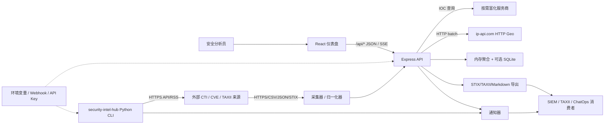

# 威胁建模

本文档基于当前代码库建立项目级威胁模型，运行态版本也会由 `GET /api/threat-model` 动态生成。模型参考 STRIDE 识别威胁，用 DREAD 做优先级排序，并将每个高风险场景绑定到控制项和验证动作。

## 方法来源

- Tony Deng 的 STRIDE 实践强调先界定范围、画 DFD、识别信任边界，再按 STRIDE 分析威胁并用 DREAD 评分。
- 美团技术团队的实践强调分层拆解系统、按元素识别威胁、输出可跟踪的整改项，避免只停留在安全评审口头结论。
- Fortinet 的概览强调威胁建模应围绕资产、潜在攻击路径、缓解措施和持续复评展开。

参考链接：

- https://tonydeng.github.io/2022/04/20/threat-modeling-was-conducted-based-on-STRIDE/
- https://tech.meituan.com/2021/04/08/Threat-Modeling-Security.html
- https://www.fortinet.com/cn/resources/cyberglossary/threat-modeling

## 范围

纳入范围：

- TypeScript 主平台：`backend/src/index.ts`、`backend/src/store.ts`、`backend/src/sources/*`、`backend/src/enrich.ts`、`backend/src/geo.ts`、`backend/src/security.ts`、`frontend/src/*`
- 导出和共享：`backend/src/stix.ts`、`backend/src/taxii.ts`、`backend/src/reports.ts`
- 通知和审计：`backend/src/notify/*`、`backend/src/persist.ts`
- 可选 Python 采集骨架：`security-intel-hub/security_intel_hub/*`
- 部署和配置：`Dockerfile`、`docs/DEPLOYMENT_CHECKLIST.md`、环境变量、`DATA_DIR`、SQLite 数据库

暂不纳入范围：

- 第三方情报源、VirusTotal/Shodan/Censys/X/Facebook/Telegram/钉钉/Slack/Webhook 平台自身的内部安全
- SIEM、工单系统、ChatOps 群组等下游消费者的内部权限模型
- 生产环境云厂商网络、主机基线和密钥管理器实现细节

## DFD

信任边界：

| 边界 | 说明 | 主要风险 |
| --- | --- | --- |
| 浏览器到 API | 仪表盘、SSE、导出下载、查询参数和 Token 传递 | Token 泄露、越权、抵赖 |
| API 到互联网来源 | 采集器、富化器、TAXII import、Geo API | 来源伪造、数据投毒、配额耗尽、明文 HTTP |
| API 到持久化 | `DATA_DIR/threat-intel.db`、审计、调查历史、健康样本 | 本地篡改、重启丢证、SQLite 多写限制 |
| API 到下游消费者 | STIX/TAXII、Markdown 报告、通知消息 | 导出篡改、敏感上下文泄露、消息伪造 |
| 部署密钥边界 | API Token、服务商凭据、Webhook、Python hub 配置 | 密钥泄露、供应商滥用、ChatOps 冒充 |

## STRIDE 矩阵

| 元素 | Spoofing | Tampering | Repudiation | Information Disclosure | Denial of Service | Elevation of Privilege |
| --- | --- | --- | --- | --- | --- | --- |
| 浏览器到 API | 被盗 Token 冒充分析员/管理员 | 下载报告被中间环节改写 | 未启用 `DATA_DIR` 时敏感动作难以归因 | 查询 Token 出现在 URL、日志或浏览器历史 | 高频查询/长连接耗尽 API 资源 | 共享管理员 Token 让查看者触达管理员接口 |
| 情报源摄取 | 仿冒或被攻陷来源发布虚假 IOC | 非预期载荷改变解析结果 | 来源变化缺乏明确责任方 | 关注来源组合暴露组织兴趣 | 上游故障、限流、慢响应导致数据过期 | 采集器配置错误扩大外部访问范围 |
| HTTP 地理定位 | 第三方服务身份不可强校验 | 明文响应可被篡改地图上下文 | 地理数据非强证据来源 | IP 指标会发往第三方 | Geo 服务不可用影响地图 | 无 |
| 密钥和 Webhook | 泄露 Webhook 发送伪造告警 | 凭据配置被替换指向攻击者端点 | 密钥轮换缺少审计依据 | 环境变量、配置、日志泄露凭据 | 凭据滥用耗尽配额 | 泄露管理员 Token 绕过角色检查 |
| SQLite 持久化 | 无 | 本地 DB 被改动影响已见状态/审计 | 纯内存模式重启丢失证据 | DB 备份泄露调查历史 | 多实例写入或磁盘满导致失败 | 文件权限过宽导致非预期访问 |
| STIX/TAXII/报告导出 | 消费者误信伪造导出来源 | 未签名报告被改写 | 下游缺少生成时间/来源难追溯 | 导出暴露调查关注点和来源组合 | 大量导出影响 API | 宽 Token 访问导出接口 |
| 通知发送 | Webhook 泄露后伪造 SOC 告警 | 消息内容被中间平台改写 | 测试发送缺少审计 | 告警摘要进入聊天系统 | 测试或告警风暴刷屏 | 管理接口被低权限用户触发 |

## DREAD 排序

评分范围为 1-10，字段为 Damage、Reproducibility、Exploitability、Affected Users、Discoverability。运行态 API 会根据当前配置动态调整部分分值和处置状态。

| 场景 | STRIDE | DREAD | 风险 | 当前处置 |
| --- | --- | --- | --- | --- |
| 服务商凭据或 Webhook 泄露 | Information Disclosure | 38-40/50 | critical | 配置 API 已脱敏；生产密钥管理仍需落地 |
| 未配置或过宽 API Token | Elevation of Privilege | 35-41/50 | high/critical | 已有角色中间件；生产必须配置角色 Token 或认证代理 |
| 高频富化请求耗尽配额 | Denial of Service | 34-37/50 | high | API 有内存限流；仍需服务商级缓存/退避 |
| 不可信上游情报投毒 | Spoofing | 34/50 | high | 已有来源、TLP、可靠性、置信度；高影响处置需多源验证 |
| 导出报告或 TAXII 数据被篡改 | Tampering | 30/50 | high | 已有审计入口；仍需签名或校验和 |
| 未启用审计持久化导致抵赖 | Repudiation | 27-29/50 | medium/high | 代码支持审计；生产需启用 `DATA_DIR` |
| Python hub 配置或 SQLite 状态泄露 | Information Disclosure | 28/50 | high | 需生产配置权限、环境变量和备份保护 |
| HTTP 地理定位泄露/篡改上下文 | Information Disclosure | 30/50 | medium | 生产建议切换 HTTPS 或本地 GeoIP |

## 已落地控制项

- `role-scoped-auth`：`backend/src/security.ts` 支持 viewer/analyst/admin Token，敏感路由使用 `requireRole`。
- `api-rate-limit`：`backend/src/security.ts` 提供按客户端和角色分桶的内存限流。
- `source-provenance`：`ThreatIndicator` 保留来源、可靠性、TLP、置信度和多来源交叉验证信息。
- `source-health-alerting`：`store.getHealth()`、`/api/sources/health`、通知健康告警可追踪来源失败/恢复。
- `secret-redaction`：`/api/config/status` 只返回配置状态和所需环境变量名，不返回密钥原文。
- `audit-events`：`audit()` 中间件和 `persist.ts` 支持持久化审计，但依赖 `DATA_DIR` 开启。
- `architecture-threat-model`：`/api/threat-model` 返回资产、数据流、信任边界、STRIDE 场景、DREAD、攻击路径和控制项，支持 Markdown 导出。

## 待办控制项

- `secret-management`：生产使用密钥管理器或受控环境变量；禁止真实密钥进入 Git、镜像、日志、前端包。
- `provider-backoff`：为 `/api/enrich` 增加服务商级缓存、退避和失败熔断，降低配额耗尽风险。
- `signed-exports`：为 STIX/TAXII/Markdown 报告增加校验和或签名，满足下游合规交换。
- `local-geoip`：将 `backend/src/geo.ts` 的 HTTP Geo 调用替换为 HTTPS 服务或本地 MaxMind 数据库。
- `cors-allowlist`：生产浏览器部署必须设置 `CORS_ORIGINS`，并通过可信入口终止 TLS。
- `python-config-permissions`：Python hub 的生产配置和 SQLite 文件放在 Git 外，限制为 Worker 用户可读写。
- `sqlite-scale-review`：多实例写入或复杂查询前，从 SQLite 迁移到 PostgreSQL 或拆分队列/Worker。

## 复评触发器

新增或修改以下内容时必须复评威胁模型：

- 新增情报源、富化服务、通知通道、TAXII import/export 或下游消费者
- 新增 API 入口、管理员动作、浏览器端 Token 传递方式或导出格式
- 改动 `DATA_DIR`、SQLite、Docker 镜像、定时任务、多实例部署或反向代理
- 改动 CORS、认证代理、API Token、密钥管理、日志策略
- 将仪表盘从私有网络暴露到团队、客户或互联网可访问环境

## 操作验证清单

- `npm run typecheck`
- `npm run test -w backend`
- `curl http://localhost:4000/api/threat-model`
- `curl 'http://localhost:4000/api/threat-model?format=markdown&lang=zh'`
- `curl http://localhost:4000/api/config/status`，确认无密钥原文
- 设置 `DATA_DIR` 后执行一次 `/api/enrich`、`/api/threat-model?format=markdown`，再查看 `/api/audit`
- 在生产部署中确认 `API_VIEWER_TOKENS`、`API_ANALYST_TOKENS`、`API_ADMIN_TOKENS` 或认证代理已配置
